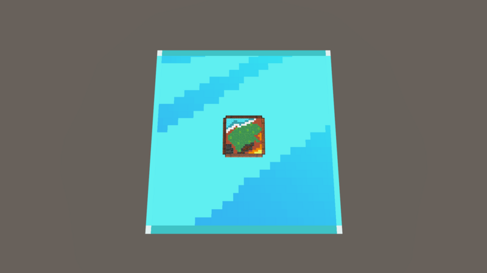

# 開發代號: 泡泡戰士 バブル●ファイター

《泡泡戰士》《バブル●ファイター》是由マカオピープル自主研發的全新本地多人遊戲，玩家們操縱不同的泡泡武器，消滅來自深淵的異種生物。

勇敢な戦士たち、ようこそ《バブル●ファイター》の戦場へ！あなたたちは様々なバブル武器を操り、深淵から現れる異種生物に立ち向かいます。この挑戦に満ちた世界で、団結と協力があなたたちの生存の鍵です。無限の戦闘と刺激に備えていますか？共に冒険を始め、我々の故郷を守りましょう！

## 遊戲教學
- 玩家1: WASD方向鍵移動、E鍵發射、R鍵並對麥克風吹泡泡重裝子彈
- 玩家2: 上下左右方向鍵移動、O鍵發射鍵、P並對麥克風吹泡泡重裝子彈

## 團結合作是你們唯一的生存之道

## 戰鬥即將開始！讓我們一同擊退敵人！

## 選擇你的武器技能，勇士！每一種武器都有獨特的力量，善用它們，才能在戰鬥中立於不敗之地！

## 讓我們一起展開冒險，保護我們的家園！

# Installation Instructions
Window 系統 10 開發

# Platforms
MS Windows
# Tools and Technologies
.Net Unity

# Languages
- Chinese, Traditional (繁體中文)
- Chinese, Simplified (简体中文)
- Japanese (日本語)